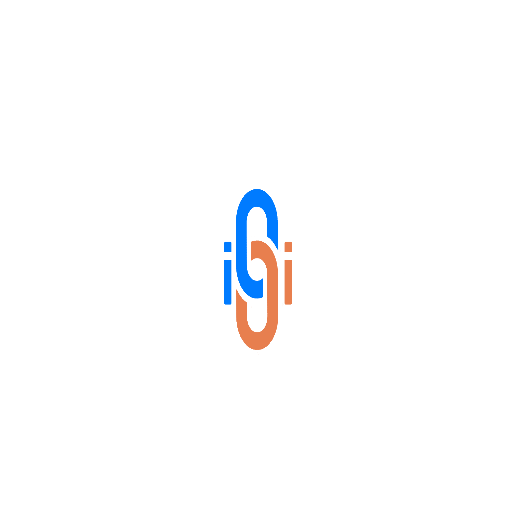

# UNILINK: Academic Community Web Application

## Project Overview

UNILINK is an innovative web application designed to enhance the academic experience for students by providing a platform for community engagement and personal productivity. This project is part of the SIA101 – System Integration and Architecture 1 course.

**Note:** This super system is not yet fully integrated.

## Subsystems

The UNILINK application consists of the following key subsystems:

1. **Community Board and Personal Productivity Suite**

   - A platform for students to connect, share ideas, and collaborate on projects.
   - Tools for personal productivity, including task management and calendar integration.

2. **Student Information and Course Scheduling**

   - A comprehensive system for managing student information and course schedules.
   - Features include course registration, timetable generation, and academic performance tracking.

3. **Learning Gaming Platform**
   - An interactive platform that gamifies the learning experience.
   - Includes educational games and challenges to enhance student engagement and knowledge retention.

## License

This project is licensed under the MIT License. See the LICENSE file for more details.

## Acknowledgments

We would like to thank our instructors and peers for their support and feedback throughout the development of this project.
